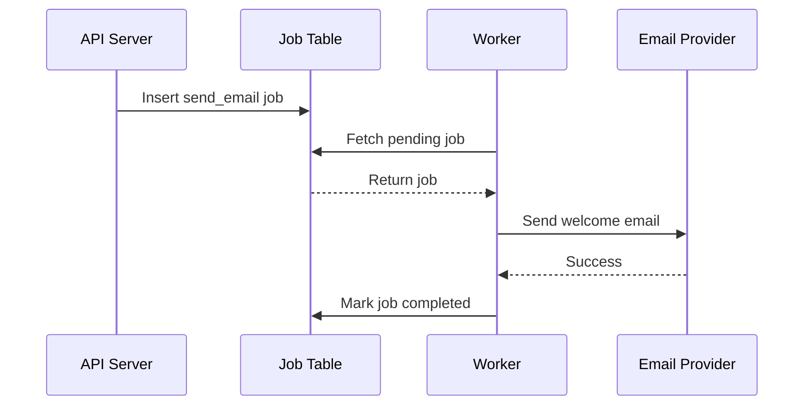

Background jobs look simple at first. You put a task into a queue, a worker picks it up, and the system does the work later.

In production, the real problem is not *how to run jobs*. The real problem is how to make the system behave correctly when things fail.

This article walks through the design of a simple but reliable job queue for a backend service written in Go.


---

## Table of Contents

1. [The Problem](#the-problem)
2. [Basic Architecture](#basic-architecture)
3. [Job Schema](#job-schema)
4. [Worker Implementation](#worker-implementation)
5. [Retry Strategy](#retry-strategy)
6. [Idempotency](#idempotency)
7. [Dead-Letter Queue](#dead-letter-queue)
8. [Observability](#observability)
9. [Common Mistakes](#common-mistakes)
10. [Conclusion](#conclusion)

---

## The Problem

Assume we have an app that sends welcome emails to new users.

The naive implementation might look like this:

```go
func RegisterUser(user User) error {
    err := db.CreateUser(user)
    if err != nil {
        return err
    }

    err = email.SendWelcomeEmail(user.Email)
    if err != nil {
        return err
    }

    return nil
}
```

This works during local development, but it has several production issues:

* Email sending can be slow.
* Email provider can be temporarily down.
* User registration should not fail only because email sending failed.
* Retrying manually is painful.
* There is no visibility into failed emails.

A better approach is to move email sending into a background job.

---

## Basic Architecture

The architecture can be kept simple:

```txt
API Server
   |
   | creates job
   v
Job Table / Queue
   |
   | polls pending jobs
   v
Worker
   |
   | executes task
   v
External Service
```

For a small system, PostgreSQL can be enough. You do not always need Kafka, RabbitMQ, or Redis Queue on day one.

---

## Job Schema

Here is a minimal PostgreSQL table for storing jobs:

```sql
CREATE TABLE jobs (
    id UUID PRIMARY KEY,
    type TEXT NOT NULL,
    payload JSONB NOT NULL,
    status TEXT NOT NULL DEFAULT 'pending',
    attempts INT NOT NULL DEFAULT 0,
    max_attempts INT NOT NULL DEFAULT 5,
    run_after TIMESTAMPTZ NOT NULL DEFAULT NOW(),
    last_error TEXT,
    created_at TIMESTAMPTZ NOT NULL DEFAULT NOW(),
    updated_at TIMESTAMPTZ NOT NULL DEFAULT NOW()
);
```

Example job payload:

```json
{
  "user_id": "user_123",
  "email": "david@example.com",
  "template": "welcome_email"
}
```

The important fields are:

| Field          | Purpose                                               |
| -------------- | ----------------------------------------------------- |
| `type`         | Defines what kind of job should run                   |
| `payload`      | Stores input data for the job                         |
| `status`       | Tracks `pending`, `running`, `completed`, or `failed` |
| `attempts`     | Counts how many times the job has been tried          |
| `max_attempts` | Prevents infinite retry                               |
| `run_after`    | Allows delayed retry                                  |
| `last_error`   | Stores failure reason for debugging                   |

---

## Worker Implementation

A worker continuously fetches pending jobs and executes them.

```go
package worker

import (
    "context"
    "encoding/json"
    "fmt"
    "time"
)

type Job struct {
    ID          string
    Type        string
    Payload     json.RawMessage
    Attempts    int
    MaxAttempts int
}

type JobHandler interface {
    Handle(ctx context.Context, payload json.RawMessage) error
}

type Worker struct {
    repo     JobRepository
    handlers map[string]JobHandler
}

func (w *Worker) Run(ctx context.Context) error {
    ticker := time.NewTicker(2 * time.Second)
    defer ticker.Stop()

    for {
        select {
        case <-ctx.Done():
            return ctx.Err()

        case <-ticker.C:
            job, err := w.repo.FetchNextPendingJob(ctx)
            if err != nil {
                return fmt.Errorf("fetch pending job: %w", err)
            }

            if job == nil {
                continue
            }

            w.processJob(ctx, *job)
        }
    }
}
```

The `processJob` function should handle success and failure explicitly.

```go
func (w *Worker) processJob(ctx context.Context, job Job) {
    handler, exists := w.handlers[job.Type]
    if !exists {
        _ = w.repo.MarkFailed(ctx, job.ID, "unknown job type")
        return
    }

    err := handler.Handle(ctx, job.Payload)
    if err != nil {
        _ = w.repo.MarkRetry(ctx, job.ID, err.Error())
        return
    }

    _ = w.repo.MarkCompleted(ctx, job.ID)
}
```

---

## Retry Strategy

Retries are necessary, but blind retries can make outages worse.

Bad retry strategy:

```txt
Retry immediately.
Retry forever.
Retry all errors the same way.
```

Better retry strategy:

```txt
Retry with exponential backoff.
Limit maximum attempts.
Separate temporary errors from permanent errors.
Move exhausted jobs to dead-letter state.
```

Example backoff calculation:

```go
func NextRunAfter(attempts int) time.Time {
    delay := time.Duration(1<<attempts) * time.Minute

    if delay > 30*time.Minute {
        delay = 30 * time.Minute
    }

    return time.Now().Add(delay)
}
```

Retry schedule example:

| Attempt |      Delay |
| ------: | ---------: |
|       1 |   1 minute |
|       2 |  2 minutes |
|       3 |  4 minutes |
|       4 |  8 minutes |
|       5 | 16 minutes |

---

## Idempotency

A job can run more than once. This is not a bug. It is a normal property of distributed systems.

Because of that, job handlers should be idempotent.

For example, this is risky:

```go
func SendWelcomeEmail(email string) error {
    return emailProvider.Send(email, "Welcome!")
}
```

If the worker crashes after sending the email but before marking the job as completed, the same job may send another email later.

A safer version:

```go
func SendWelcomeEmail(ctx context.Context, userID string, email string) error {
    alreadySent, err := emailRepo.HasSent(ctx, userID, "welcome_email")
    if err != nil {
        return err
    }

    if alreadySent {
        return nil
    }

    err = emailProvider.Send(email, "Welcome!")
    if err != nil {
        return err
    }

    return emailRepo.MarkSent(ctx, userID, "welcome_email")
}
```

The key principle:

> The worker may execute the same job more than once, but the business effect should happen only once.

---

## Dead-Letter Queue

After too many failed attempts, a job should not retry forever. It should move into a dead-letter state.

```sql
UPDATE jobs
SET
    status = 'dead',
    last_error = $2,
    updated_at = NOW()
WHERE id = $1;
```

Dead-letter jobs are useful because engineers can inspect them later.

Example dashboard:

| Job ID    | Type              | Attempts | Last Error         | Created At         |
| --------- | ----------------- | -------: | ------------------ | ------------------ |
| `job_001` | `send_email`      |        5 | `provider timeout` | `2026-05-23 10:00` |
| `job_002` | `sync_wallet_tx`  |        5 | `invalid payload`  | `2026-05-23 10:05` |
| `job_003` | `generate_report` |        5 | `file not found`   | `2026-05-23 10:10` |

---

## Observability

A job queue without observability becomes a black box.

At minimum, track these metrics:

```txt
jobs_created_total
jobs_completed_total
jobs_failed_total
jobs_dead_total
job_processing_duration_seconds
job_attempts_total
```

Example structured log:

```json
{
  "level": "error",
  "message": "job failed",
  "job_id": "job_001",
  "job_type": "send_email",
  "attempt": 3,
  "max_attempts": 5,
  "error": "email provider timeout",
  "trace_id": "trace_abc123"
}
```

Example Prometheus query:

```promql
sum(rate(jobs_failed_total[5m])) by (job_type)
```

This helps answer questions like:

* Which job type is failing the most?
* Did failures spike after deployment?
* Are jobs stuck in pending state?
* Is processing latency increasing?
* Are retries hiding a deeper dependency issue?

---

## Common Mistakes

### 1. No Idempotency

If duplicate execution causes duplicate payment, duplicate email, or duplicate notification, the design is unsafe.

### 2. Infinite Retry

Infinite retry hides broken jobs and wastes resources.

### 3. No Locking

If multiple workers fetch the same pending job, the same job may run concurrently.

In PostgreSQL, use `FOR UPDATE SKIP LOCKED`:

```sql
SELECT *
FROM jobs
WHERE status = 'pending'
  AND run_after <= NOW()
ORDER BY created_at ASC
LIMIT 1
FOR UPDATE SKIP LOCKED;
```

### 4. No Timeout

Every job should have a timeout.

```go
ctx, cancel := context.WithTimeout(parentCtx, 30*time.Second)
defer cancel()
```

Without timeout, one stuck external request can block a worker forever.

### 5. No Separation Between Temporary and Permanent Errors

Some errors should not be retried.

Example permanent errors:

* Invalid email address
* Invalid payload
* Missing required user data
* Unsupported job type

Example temporary errors:

* Provider timeout
* Rate limit
* Network failure
* Database connection issue

---

## Sequence Diagram



---

## Checklist

Before shipping a background job system, verify:

* [x] Jobs have clear status.
* [x] Jobs have limited retry.
* [x] Failed jobs store error messages.
* [x] Handlers are idempotent.
* [x] Workers use locking.
* [x] Jobs have timeout.
* [x] Metrics are available.
* [x] Logs include job ID and job type.
* [x] Dead-letter jobs can be inspected.
* [x] There is a way to manually retry dead jobs.

---

## Final Thoughts

A reliable job queue is not only about running tasks in the background. It is about controlling failure.

The minimum production-ready design should include:

1. Persistent job storage
2. Safe worker locking
3. Retry with backoff
4. Idempotent handlers
5. Dead-letter handling
6. Metrics and structured logs

For small systems, PostgreSQL is often enough. For high-throughput systems, dedicated queue infrastructure may be better. The important part is not the tool choice, but the failure model.

---

## References

* [PostgreSQL `FOR UPDATE SKIP LOCKED`](https://www.postgresql.org/docs/current/sql-select.html)
* [Prometheus Documentation](https://prometheus.io/docs/introduction/overview/)
* [OpenTelemetry Documentation](https://opentelemetry.io/docs/)
* [Go Context Package](https://pkg.go.dev/context)
